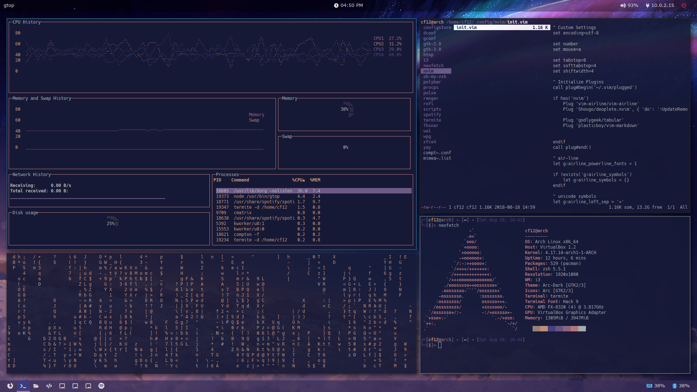

# CF12's Dotfiles
A repo containing dotfiles for my custom Arch Linux i3-gaps workspace

### Image Showcase
#### Preset


#### Wallpaper


**Modules / Packages Used:**

| Name		       | Details |
| -------------- | ------- |
| i3-gaps	    	 | Window manager w/ gaps
| Polybar		     | Creates the bars at the top & bottom
| Pywal			     | Generates the custom color scheme from wallpaper
| URxvt			     | Terminal emulator used
| Termite        | Another terminal emulator
| Zsh			       | Terminal shell used
| Oh-My-Zsh!     | Script / Tool used for customizing zsh
| Neovim         | A better vim
| Rofi		       | Custom Dmenu replacement
| Compton	       | Window compositor - Adds shadows, blurs, & transitions
| Thunar	     	 | GUI file manager
| Font Awesome 5 | Font that provides the icons

#### What's Included:
- i3-gaps config (with the gaps)
- Polybar bars & configs
- URxvt AND Termite configs
- Optimized compton configs
- Oh-My-Zsh! configs
- Neovim configs
- Wallpaper

## Wallpaper
Wallpaper is from the movie, *"Kimi No Na Wa (Your Name),"* and was scaled up to **3920 x 2160** using [Waifu2x](http://waifu2x.udp.jp/)

## Wait CF12, why do you have configs for both URxvt AND Termite?
URxvt was being fucky, and not displaying UTF-8 chars correctly for me, which prompted me to switch over to Termite for the time being. If you're having better luck with it, that's great, just know that I'll probably still be in termite-land.

## Great shit dog, how do I install this pile of litty shit?
I'm only sticking instructions for Arch Linux here, so if you're on another distro, ~~switch to arch right now you peasant~~ instructions and package names will vary likely.

#### Packages installable from Pacman / AUR
- git
- i3 (Group)
- i3-gaps
- xorg (Group)
- polybar
- feh
- python-pywal
- rofi
- zsh
- oh-my-zsh-git
- rxvt-unicode / termite
- neovim
- thunar
- compton
- xcwd-git
- betterlockscreen
- playerctl
- pulseaudio
- arc-gtk-theme
- arc-icon-theme
- ttf-font-awesome
- powerline-fonts-git
- noto-fonts
- ttf-ms-fonts
- jsoncpp
- light

#### GitHub Links (In case you need them)
- betterlockscreen by pavanjadhaw [[GitHub](https://github.com/pavanjadhaw/betterlockscreen)]
- xcwd by schischi [[GitHub](https://github.com/schischi/xcwd)]
- oh-my-zsh [[GitHub](https://github.com/robbyrussell/oh-my-zsh)]
- powerline-fonts [[GitHub](https://github.com/powerline/fonts)]
- vim-plug [[GitHub](https://github.com/junegunn/vim-plug)]
- arc-theme [[GitHub](https://github.com/horst3180/arc-theme)]
- arc-icon-theme [[GitHub](https://github.com/horst3180/arc-icon-theme)]

Example install cmd (Using the yay package manager):
```
yay -Sy git i3 i3-gaps xorg polybar feh python-pywal rofi zsh oh-my-zsh-git rxvt-unicode termite neovim thunar compton xcwd-git betterlockscreen playerctl pulseaudio arc-gtk-theme arc-icon-theme ttf-font-awesome powerline-fonts-git noto-fonts ttf-ms-fonts jsoncpp light python-setuptools
```

## Setup
#### Set default shell to zsh
```
chsh -s /bin/zsh
```

#### Set + Cache color palettes
In order to apply the color scheme for zsh and betterlockscreen, you need to set the wallpaper w/ pywal, which will also generate & cache the color palettes for zsh and betterlockscreen. (Note that if you wish to change the wallpaper and regenerate the color scheme, you will have to run this command again.)

```
wal -i ~/wallpaper.png
```

#### Update betterlockscreen
Betterlockscreen needs to be ran every time you update the wallpaper / monitor configuration, in order to generate accurate images for the lockscreen.
```
betterlockscreen ~/wallpaper.png
```

#### Install Oh-My-Zsh
Instead of directly installing oh-my-zsh from the Arch AUR, I installed it through their install scripts from the GitHub repo.

Curl:
```
sh -c "$(curl -fsSL https://raw.githubusercontent.com/robbyrussell/oh-my-zsh/master/tools/install.sh)"
```

Wget:
```
sh -c "$(wget https://raw.githubusercontent.com/robbyrussell/oh-my-zsh/master/tools/install.sh -O -)"
```

#### Install + Setup vim plug
Install vim plug via the following command:
```
curl -fLo ~/.local/share/nvim/site/autoload/plug.vim --create-dirs https://raw.githubusercontent.com/junegunn/vim-plug/master/plug.vim
```

Then, launch nvim using `nvim`, and run the command `:PlugInstall`

## Known Issues
#### No module named pkg_resources (While running wal)
[Stack Overflow Link](https://stackoverflow.com/questions/7446187/no-module-named-pkg-resources)

Reinstall setuptools:
```
yay -Sy python-setuptools
```
